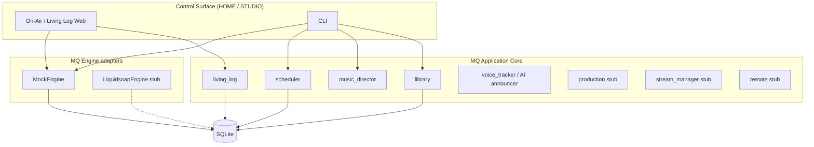

# MQ Radio Automation — Milestone 2+ (Living Log programming)

Modular broadcast automation for **MQ DIGITAL RADIO**.  
One app UX; playout engines underneath so **UI crash ≠ station dead air**.

Control surface (HOME / On-Air prototype) is separate from **MQ Engine** (background playout service).

## Architecture



**HOME** = Master Control 24/7 · **STUDIO** = live/remote contribution only (M2+).

Deterministic **scheduler** commits the **Living Log** ahead of airtime. AI never picks the next song live.

Broadcast language: clocks, categories, Living Log, ETMs — not Spotify language.

## Quick start

```bash
cd mq-radio-automation

# optional venv
python3 -m venv .venv
source .venv/bin/activate   # Windows: .venv\Scripts\activate
pip install -e ".[dev]"     # or: pip install -r requirements.txt && pip install -e .

# Initialise DB, seed demo library + GENERAL clock + MQ DIGITAL rules
python -m mq_radio init-db
python -m mq_radio seed-demo

# Generate today's 24h Living Log (scored vs separation — not random)
python -m mq_radio generate-log
python -m mq_radio show-log --limit 40

# Step MockEngine through the committed log
python -m mq_radio engine-step
python -m mq_radio engine-step --action play

# Editable sample hour
python -m mq_radio load-sample-hour --date today

# On-Air web prototype
python -m mq_radio serve --host 127.0.0.1 --port 8080
# open http://127.0.0.1:8080/
```

### CLI commands

| Command | Purpose |
|---------|---------|
| `init-db` | Create/migrate SQLite schema |
| `scan [--path DIR]` | Index audio into library |
| `seed-demo` | Categories, GENERAL clock, MQ DIGITAL rules, synthetic WAV fixtures |
| `generate-log [--date YYYY-MM-DD] [--force]` | Build 24h Living Log; preserves MANUAL unless `--force` |
| `show-log [--date] [--limit N]` | Print log |
| `engine-step [--action step\|play\|stop\|skip]` | MockEngine advance |
| `serve [--port 8080]` | On-Air prototype |
| `generate-ai-breaks [--date] [--no-insert]` | Fill VT placeholders + insert AI scripts (DRAFT) |
| `approve-ai-breaks [--date]` | Promote DRAFT VT scripts to APPROVED / COMMITTED |
| `list-vt [--date] [--status]` | List voice-track scripts |
| `load-sample-hour [--date today] [--hour 12]` | Clear day fluff; load editable 1-hour MANUAL sample |


## 24/7 AUTO + jump-in workflow

Matt’s locked vision: automated 24/7 playout he can jump into whenever inspired/free.

| Mode | Who talks | Who picks music |
|------|-----------|-----------------|
| **AUTO** (default) | AI overnight announcer scripts on the *committed* Living Log | Deterministic scheduler only |
| **ASSIST / LIVE** | Matt (Voice Tracking / live mic) | Still the committed log — AI never picks next song live |
| Hand-back | Flip mode → AUTO; AI / imaging continue from the log | Same Living Log |

### AI announcer vs Voice Tracking

- **AI announcer (M2):** template/rules scripts (optional LLM hook later) → `VOICE_TRACK` rows + `vt_scripts` table. Status **DRAFT** until approved. No real TTS audio yet — script + log placement is enough.
- **Voice Tracking (jump-in):** operator opens VT studio on a log transition, can generate/edit a script, **Record** via browser mic (MediaRecorder) with trim in/out; saves under data/vt/ and attaches to the VT event. Vocloner remains. When Matt goes LIVE/ASSIST he talks; when done, hand back to AUTO.
- **Voice renderer (default: Vocloner):** Matt’s Vocloner Basic Yearly (~1.2M chars/year). No public API — MQ copies the approved script and opens Vocloner for paste/render.

### Vocloner pipeline (default voice render)

1. Generate AI breaks → review scripts on the Living Log / VT Studio.
2. **Approve drafts** (CLI `approve-ai-breaks` or On-Air **Approve drafts**).
3. **Render in Vocloner** (VT Studio or Living Log toolbar): copies the script to the clipboard and opens [vocloner.com](https://vocloner.com/). Prefer your saved model/voice name from Settings.
4. In Vocloner: paste → generate → export **WAV**.
5. Drop the WAV into the library / VT slot for that break.

Settings ⚙ → **Voice renderer: Vocloner (default)** + notes / preferred model field. Persists to `localStorage` and `data/vocloner.json` (`voice_renderer: vocloner`) via `/api/settings/vocloner`. Audio bus routing stays in `data/audio_outputs.json`.

Future: browser automation / official API if Vocloner adds one — until then this clipboard + open URL path is intentional.

### Try it (CLI)

```bash
python -m mq_radio init-db
python -m mq_radio seed-demo
python -m mq_radio generate-log --date 2026-09-05
python -m mq_radio generate-ai-breaks --date 2026-09-05
python -m mq_radio list-vt --date 2026-09-05 --status DRAFT
python -m mq_radio approve-ai-breaks --date 2026-09-05
python -m mq_radio show-log --date 2026-09-05 --limit 40
```

### Try it (On-Air desk)

```bash
python -m mq_radio serve --host 127.0.0.1 --port 8080
```

1. Open the Living Log date.
2. Click **Generate AI breaks** → VT rows appear / fill with script previews (DRAFT).
3. Click **Approve drafts** when happy.
4. Click any log row (especially VT) → **Voice Track Studio**: **AI Generate Script** works; **Render in Vocloner** copies the script and opens Vocloner; **Record** stays disabled for M2.
5. Drop the Vocloner WAV into the library / VT slot; Mode bank AUTO / ASSIST / LIVE is the jump-in control surface (ASSIST also shows VOCALS IN talk-up).

## M1 vs roadmap

| Area | M1 (this zip) | Later |
|------|---------------|--------|
| Library / scanner | WAV + sidecar JSON, demo fixtures | Full tagging, APRA/PPCA workflows |
| Scheduler | Clock expansion, separation scoring, MANUAL preserve | Multi-clock grids, fills, hard ETMs |
| Engine | MockEngine + Liquidsoap stub | Real Liquidsoap / stream chain |
| UI | On-Air Living Log prototype | Full HOME + STUDIO surfaces |
| Voice / production / remote | AI VT scripts + Vocloner render path (clipboard) | Vocloner automation/API if available, production cart, remotes |
| Stream manager | Stub | Encoders, mounts, failover |

## Package layout

```
mq_radio/
  library/          # scan & ingest
  music_director/   # seed, rules helpers
  scheduler/        # clock expansion + scored log generate
  living_log/       # query Living Log
  voice_tracker/    # AI announcer scripts + VT studio hooks (M2)
  ai_announcer/     # alias → voice_tracker
  production/       # stub
  stream_manager/   # stub
  remote/           # stub
  engine/           # MockEngine + LiquidsoapEngine stub
  db/               # SQLite + migrations
  web/              # On-Air prototype
  cli/              # mq-radio commands
```

## Event types & timing

**Events:** MUSIC, SWEEPER, ID, PROMO, VOICE_TRACK, BED, SHOW, LIVE, COMMAND, ETM, BREAK, FILLER  

**Chain:** AUTO · MIX · CUT · MANUAL · HOLD  

**Timing:** FLOAT · SOFT · HARD · RESET · HIT · TIME_WINDOW

## Tests

```bash
pip install pytest
pytest -q
```

## Data

Default DB: `data/mq_radio.db`  
Demo audio: `fixtures/demo_audio/` (synthetic short WAVs + JSON metadata)

## Notes

- Playout is behind an adapter; the UI talks to Living Log / MockEngine only.
- Scheduler is deterministic given library + rules + clock — not live AI selection.
- Inspired by Zetta/NETIA *workflows*; not a clone of proprietary UI/IP.

## On-Air UI direction

The web On-Air surface (`mq_radio/web/static/`) targets a **mid-1990s broadcast playout desk** feel — dense RCS Maestro / early Zetta *workflow* aesthetics only:

- Cart/player decks A·B·C (ON AIR / NEXT / READY)
- Scrolling Living Log with monospace air times + type tags (MUSIC / ID / SWEEPER / PROMO / VT)
- Hotkey grid, chunky AUTO / ASSIST / LIVE mode bank
- Studio clock + TO TIME / ETM readout
- Win95/CRT control-room palette (gray/beige panels, hard borders, high contrast)
- Air-studio ELAPSED / REMAINING timers + ending type (COLD / SOFT / FADE)
- End-of-cart colour ramp on the last 5 seconds
- Settings ⚙ multi-bus audio output routing (mock devices in web demo)

No proprietary logos, trademarks, or pixel-perfect clones. Avoid modern SaaS / Spotify chrome (no glassmorphism, no huge whitespace).


## On-Air timers, endings & audio routing

**Deck timers (air-studio style):** Deck A shows monospace **ELAPSED** / **REMAINING** (tenths) driven by `/api/status` → `timing`, with local 250ms extrapolation so the desk stays smooth between polls. PLAY holds the cart until the timer expires (`finish_if_due`).

**End-of-cart warning:** Over the last **5 seconds**, Deck A (panel + progress meter) runs a green→amber→red **colour ramp** that intensifies toward 0.

**Ending / last-word style:** Now-playing (and log events) expose `intro_ms`, `outro_ms`, `ending_type`, and `ending_label` from the tracks table:
- **COLD** — `outro_ms` < 2500
- **SOFT** — between 2500 and 5000
- **FADE** — `outro_ms` ≥ 5000
- Imaging without track metadata uses short-duration → COLD / longer → FADE heuristics
- UI readout examples: `FADE · 8.0s`, `INTRO 5.2s · FADE · 8.0s`

**Audio outputs (Settings ⚙):** Multi-bus routing — Program/On-Air, Monitor/Cue, Headphones/Talent, Stream Encode (or Same as Program), Record Bus. Choices persist to `localStorage` and `data/audio_outputs.json` via `/api/settings/audio`. The web prototype lists **mock devices** (Built-in Output, USB Interface, Aggregate Device, BlackHole 2ch, None) for UX; **real CoreAudio device enumeration comes with the Mac engine**.

**Voice renderer (Settings ⚙ / VT Studio):** Default **Vocloner** (`voice_renderer: vocloner` in `data/vocloner.json` + `localStorage`). Preferred model/voice notes field; **Render in Vocloner** copies script → opens https://vocloner.com/.


## On-Air desk — VU, carts, ingest, Segment Editor, VT inbox, processing

**PROGRAM VU:** Stereo LED meter on the top strip. Fed from Web Audio AnalyserNode on the program bus when carts/hotkeys play; synthetic fallback when the graph is idle. Peak-hold readout in dB; greens/ambers/reds like a classic on-air desk.

**Cart decks:** Deck A/B/C titles and artists wrap and scroll — no clipped ellipsis. Hover shows full cart metadata.

**Drag-and-drop ingest:** Drop `.wav` / `.mp3` / `.flac` / `.mp4` on the desk or the DROP AUDIO zone (or Browse…). Files land under `data/library/` and register as library carts (SQLite). MP4 extracts audio via **ffmpeg** (video not kept). FLAC is decoded to WAV when ffmpeg is available. Long concerts/interviews are supported.

**Segment Editor:** Distinct from Segue Editor. Open from the ingest strip → pick a long cart → set IN/OUT (ms) with mark tools → save each slice as its own library cart (`data/segments/`). Uses ffmpeg to cut.

**Import from Downloads / VT inbox:** One-click import of Vocloner (and other) `.mp3`/`.wav`/`.flac`/`.mp4` renders.
- Mac: defaults to `~/Downloads` when present
- Linux/web demo: `data/vt-inbox` (override with Settings → VT inbox path, or env `MQ_RADIO_VT_INBOX`)
- Copies into `data/vt/` + library; optionally attaches audio to the selected VT log event

**On-air processing (native):** Settings → **ON-AIR PROCESSING**. Topology is public broadcast practice — **AGC → EQ → Multiband → Exciter → Peak Limiter** — with **FM** (dense on-air, pre-emphasis) and **Digital** (stream/DAB, ISR-aware) templates. This is **not** an Orban Optimod schematic clone and **not** AU/AAX hosting (optional AU hosting remains a later Mac *production-bus* feature only). Params persist to `data/processing.json`; the On-Air page applies an audible Web Audio approximation on the program bus (template audition on Load FM/Digital). Transmission-path DSP remains Liquidsoap/Mac later.

API highlights: `POST /api/library/ingest`, `POST /api/library/segment`, `POST /api/vt/import-inbox`, `POST /api/hotkey/fire` (inject), `GET|POST /api/settings/processing`, `GET|POST /api/settings/processing/export`, `vu` + `processing` + `oneshot` on `/api/status`.


## Broadcast-ready bar (production-desk vs mock)

Matt’s release bar: next DMG must meet **broadcast-ready specs**, not a thin stub ship.

### Production-desk in this build (real, usable)
- Living Log edit (insert/replace/delete), sample hour, AUTO/ASSIST/LIVE modes
- Cart decks A/B/C with full title/artist (no clipped ellipsis), timers, end-ramp
- **PROGRAM VU** stereo LED meter fed from Web Audio **AnalyserNode** on the program bus when audio plays (synthetic fallback when idle)
- **Drag-drop / Browse ingest** of `.wav` `.mp3` `.flac` `.mp4` → copies into `data/library/` + SQLite carts (ffmpeg for mp4/flac decode)
- **Segment Editor** — cut long carts into library segments (`data/segments/`); distinct from Segue Editor
- **VT Studio mic Record** (MediaRecorder) → mark IN/OUT → **Save take to log** (cleaned cut via ffmpeg when available) → optional **Segment Editor** on that take → attach to Living Log VT
- **Import from Downloads / VT inbox** (Mac `~/Downloads` or `data/vt-inbox` / `MQ_RADIO_VT_INBOX`)
- **Hotkey / one-shot carts** store **absolute path references** and fire without copying into the library; library ingest only on explicit drop/import
- **Native on-air processing** templates **FM** + **Digital** (AGC→EQ→Multiband→Exciter→Limiter) persisted in `data/processing.json` and applied in the browser On-Air Web Audio graph (audible template switch)
- **End-pulse AUTO advance**: ingest outro/end-pulse marks; MockEngine fires next Living Log event on pulse (not only EOF); ASSIST/LIVE hold
- **Segue Editor audition**: real outgoing/incoming(/VT) media URLs with duck + crossfade_ms (tone fallback)
- **Editable end-pulse** on Segment Editor / cart metadata; flash clears when pulse fires; ingest sets sensible outro defaults
- **Overlapping dual-deck segue**: AUTO end-pulse starts the next Living Log cart on the **other** deck while the current fades (classic overlap). Web Audio: dual MediaElementSources (deck A/B) with crossfade gains into the program processing chain (equal-power + optional duck). Segue Editor markers (`from_outro_mark_ms` / `to_intro_mark_ms` / `vt_*` / `duck_db` / `crossfade_ms`) drive the overlap when present; otherwise defaults from end-pulse/outro. `/api/status` exposes `decks` A/B, `active_deck`, `overlap_active`, `segue`. ASSIST/LIVE arm **GO** on pulse (Space or STEP fires overlapping advance).
- **AI DJ / overnight volume ramps**: fade in/out profiles applied on the program play path (`data/ramps.json`)
- **Hotkey one-shot audio**: resolved path/track plays through the On-Air program bus with fire/end pulse flash
- **Hotkey → engine inject**: fire optionally injects into MockEngine as **over program** (transient oneshot, Living Log AUTO untouched) or **queue next** (MANUAL insert after ON AIR); desk shows clear feedback; `/api/status` exposes `oneshot`
- **VT / Segment server-side trim**: ffmpeg cuts/re-encodes IN/OUT when available (`trim_mode=cut`); **markers-only** fallback when ffmpeg missing (VT Save take + Segment Editor)
- **Liquidsoap processing handoff stub**: `packaging/liquidsoap/` (+ `data/processing/`) JSON + `.liq` snippet for FM/Digital templates — not a full Optimod clone (`POST /api/settings/processing/export`)
- **MQ Digital library root** + VT inbox paths in Settings (ingest lands under configured root)
- **Studio routing matrix**: Program (processed), Monitor, Headphones, Aux 1/2, **Mix-minus ↔ Aux input** (caller/Zoom), Stream, Record — persisted
- **Program AU insert slot** stub: `(none) / Native only` persisted; empty slot → native chain is main output

### Still mock / deferred (called out, not fake-ready)
- **Device enumeration**: mock device names in web demo; real CoreAudio on Mac engine later
- **AU/AAX hosting**: insert slot + config only — **not** hosting plugins on-air; optional AU remains later Mac *production-bus* feature
- **True multiband DSP / hardware chain**: browser On-Air graph approximates AGC/EQ/multiband/exciter/limiter so FM vs Digital is audible; Liquidsoap/Mac engine still owns transmission-path processing (handoff stub exported under `packaging/liquidsoap/`)
- **Hotkey engine inject on real Liquidsoap**: MockEngine inject works now; Liquidsoap telnet/harbor inject remains later
- **Hotkey path on pure web**: browsers hide absolute paths — Electron/desktop provides `File.path`; web UI asks operator to paste path


## Operator desk guide (broadcast-ready)

Quick reference for the On-Air surface — what to use when.

### DROP AUDIO vs hotkeys
- **DROP AUDIO / Browse / Import from Downloads** → copies into the **library** (`data/library/` or configured MQ Digital library root) and registers a cart with sensible **intro / end-pulse** defaults.
- **Hotkey grid drop / path field** → stores an **absolute path reference** and plays **in place** (no library copy).
  - **Electron / Mac app:** drop a file on a hotkey slot — `File.path` is captured automatically.
  - **Browser (web paste):** browsers hide disk paths — Edit the slot and paste the full path (e.g. `/Users/matt/Audio/Sweeper.wav`).

### Segment Editor vs Segue Editor
| Tool | Purpose |
|------|---------|
| **Segment Editor** | Cut a long cart (concert / interview / VT take) into shorter library carts. Edit **Intro** and **End-pulse / outro** marks on cart metadata (drives AUTO). |
| **Segue Editor** | Shape the **transition** between outgoing → optional VT → incoming (duck dB, crossfade ms, outro/intro marks). **Audition** plays real library media with duck + crossfade (tone fallback if media missing). |

### Dual-deck AUTO / ASSIST
- **AUTO** — end-pulse starts the next Living Log cart on the **other** deck while the current fades (overlapping segue). Crossfade/duck from Segue Editor when present; else from outro/end-pulse defaults.
- **ASSIST / LIVE** — pulse **arms GO** (Space / STEP) for operator-timed overlap; does not auto-chain.
- Mode bank on the desk flips playout mode; Living Log remains the authority (AI never picks next song live).

### Processing FM / Digital
Settings → **ON-AIR PROCESSING**: public broadcast topology **AGC → EQ → Multiband → Exciter → Limiter**.
- **FM** — denser on-air, pre-emphasis flavour.
- **Digital** — stream/DAB-leaning, slightly cleaner ceiling.
Audible on the Web Audio program bus (template audition on Load). Not an Orban clone; transmission-path DSP remains Liquidsoap/Mac later.

### Mix-minus
Settings → routing matrix: **Mix-minus ↔ Aux input** for caller/Zoom return (Program minus talent). Persists with other buses (Program, Monitor, Headphones, Aux 1/2, Stream, Record). Device names are mock in the web demo — real CoreAudio enum is Mac-later.

### Library root
Settings → **MQ Digital library root** (or env `MQ_RADIO_LIBRARY_ROOT` / `data/library-root.json`). Ingest lands under this folder. Default: `data/library/`.

### Hotkeys in-place
F1–F12 fire page-1 slots. Edit mode: click to edit, drag to reorder. Fire shows visual pulse on the button + program deck; end flash clears so the desk does not stick red. Path one-shots never force a library ingest.

### Gatekeeper first open (Mac)
After installing from the CI ZIP/DMG, prefer **Open MQ Radio.command** (ships next to the app in the artifact): runs `xattr -cr` + ad-hoc `codesign` then opens the app. Or right-click → Open once.

### Local demo beds
`python -m mq_radio seed-demo` writes richer harmonic fixtures under `fixtures/demo_audio/` and slightly longer beds under **`data/demo_beds/`** (gitignored — keeps the installer lean).

## Mac install (DMG)

### One-time: enable the DMG builder (needs workflow file on GitHub)

The GitHub OAuth token used to push code does **not** include the `workflow` scope, so the Actions file lives in-repo as a template:

`packaging/ci/macos-dmg.yml`

**Matt — do this once in the browser (signed in as MQDIGITALRADIO):**

1. Open https://github.com/MQDIGITALRADIO/MQ_Grok_Build/new/main?filename=.github/workflows/macos-dmg.yml

2. Copy the full contents of `packaging/ci/macos-dmg.yml` from the repo and paste into the editor.

3. Commit directly to `main` (message: `Add macOS DMG workflow`).

4. Open Actions → **macOS DMG** → the run starts automatically (or click **Run workflow**).

5. When green, open the run → Artifacts → download **MQ-Radio-macOS-DMG**.

Optional later: `gh auth refresh -s workflow` so future pushes can update workflows from git.

### Install the DMG on your Mac

1. Open the GitHub Actions run for **macOS DMG** on the `main` branch:
   https://github.com/MQDIGITALRADIO/MQ_Grok_Build/actions/workflows/macos-dmg.yml
2. Download the artifact **MQ-Radio-macOS-DMG** (contains `.dmg` and `.zip`).
3. Open the DMG (or unzip) and drag **MQ Radio** into **Applications**.
4. First launch (unsigned / ad-hoc signed build): prefer **Open MQ Radio.command** from the ZIP/DMG (xattr + ad-hoc codesign + open), or Finder → Applications → **right-click MQ Radio → Open** → confirm Open.
   Apple Gatekeeper blocks unsigned apps until you do this once. Apple Developer signing comes later.
5. MQ Radio opens the On-Air UI. First run auto-creates a demo library and Living Log.

**If macOS says the app is “damaged” and can’t be opened** (Gatekeeper quarantine on CI builds without an Apple Developer cert):

```bash
xattr -cr "/Applications/MQ Radio.app"
codesign --force --deep --sign - "/Applications/MQ Radio.app"
```

Then **right-click → Open**, or System Settings → Privacy & Security → **Open Anyway**.

Station data: `~/Library/Application Support/MQ Radio/` (Electron userData).

### What the Mac app does

- Double-click app window (no Terminal)
- Bundled engine serves On-Air at `http://127.0.0.1:8080`
- Quitting the app stops the engine

Rebuilds run automatically on push to `main` via `.github/workflows/macos-dmg.yml`.

