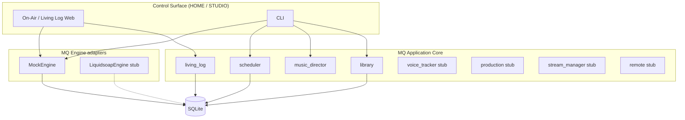

# MQ Radio Automation — Milestone 1

Modular broadcast automation for **MQ DIGITAL RADIO**.  
One app UX; playout engines underneath so **UI crash ≠ station dead air**.

Control surface (HOME / On-Air prototype) is separate from **MQ Engine** (background playout service).

## Architecture



**HOME** = Master Control 24/7 · **STUDIO** = live/remote contribution only (M2+).

Deterministic **scheduler** commits the **Living Log** ahead of airtime. AI never picks the next song live.

Broadcast language: clocks, categories, Living Log, ETMs — not Spotify language.

## Quick start

```bash
cd mq-radio-automation

# optional venv
python3 -m venv .venv
source .venv/bin/activate   # Windows: .venv\Scripts\activate
pip install -e ".[dev]"     # or: pip install -r requirements.txt && pip install -e .

# Initialise DB, seed demo library + GENERAL clock + MQ DIGITAL rules
python -m mq_radio init-db
python -m mq_radio seed-demo

# Generate today's 24h Living Log (scored vs separation — not random)
python -m mq_radio generate-log
python -m mq_radio show-log --limit 40

# Step MockEngine through the committed log
python -m mq_radio engine-step
python -m mq_radio engine-step --action play

# On-Air web prototype
python -m mq_radio serve --host 127.0.0.1 --port 8080
# open http://127.0.0.1:8080/
```

### CLI commands

| Command | Purpose |
|---------|---------|
| `init-db` | Create/migrate SQLite schema |
| `scan [--path DIR]` | Index audio into library |
| `seed-demo` | Categories, GENERAL clock, MQ DIGITAL rules, synthetic WAV fixtures |
| `generate-log [--date YYYY-MM-DD] [--force]` | Build 24h Living Log; preserves MANUAL unless `--force` |
| `show-log [--date] [--limit N]` | Print log |
| `engine-step [--action step\|play\|stop\|skip]` | MockEngine advance |
| `serve [--port 8080]` | On-Air prototype |

## M1 vs roadmap

| Area | M1 (this zip) | Later |
|------|---------------|--------|
| Library / scanner | WAV + sidecar JSON, demo fixtures | Full tagging, APRA/PPCA workflows |
| Scheduler | Clock expansion, separation scoring, MANUAL preserve | Multi-clock grids, fills, hard ETMs |
| Engine | MockEngine + Liquidsoap stub | Real Liquidsoap / stream chain |
| UI | On-Air Living Log prototype | Full HOME + STUDIO surfaces |
| Voice / production / remote | Package stubs | Voice tracker, production cart, remotes |
| Stream manager | Stub | Encoders, mounts, failover |

## Package layout

```
mq_radio/
  library/          # scan & ingest
  music_director/   # seed, rules helpers
  scheduler/        # clock expansion + scored log generate
  living_log/       # query Living Log
  voice_tracker/    # stub
  production/       # stub
  stream_manager/   # stub
  remote/           # stub
  engine/           # MockEngine + LiquidsoapEngine stub
  db/               # SQLite + migrations
  web/              # On-Air prototype
  cli/              # mq-radio commands
```

## Event types & timing

**Events:** MUSIC, SWEEPER, ID, PROMO, VOICE_TRACK, BED, SHOW, LIVE, COMMAND, ETM, BREAK, FILLER  

**Chain:** AUTO · MIX · CUT · MANUAL · HOLD  

**Timing:** FLOAT · SOFT · HARD · RESET · HIT · TIME_WINDOW

## Tests

```bash
pip install pytest
pytest -q
```

## Data

Default DB: `data/mq_radio.db`  
Demo audio: `fixtures/demo_audio/` (synthetic short WAVs + JSON metadata)

## Notes

- Playout is behind an adapter; the UI talks to Living Log / MockEngine only.
- Scheduler is deterministic given library + rules + clock — not live AI selection.
- Inspired by Zetta/NETIA *workflows*; not a clone of proprietary UI/IP.
